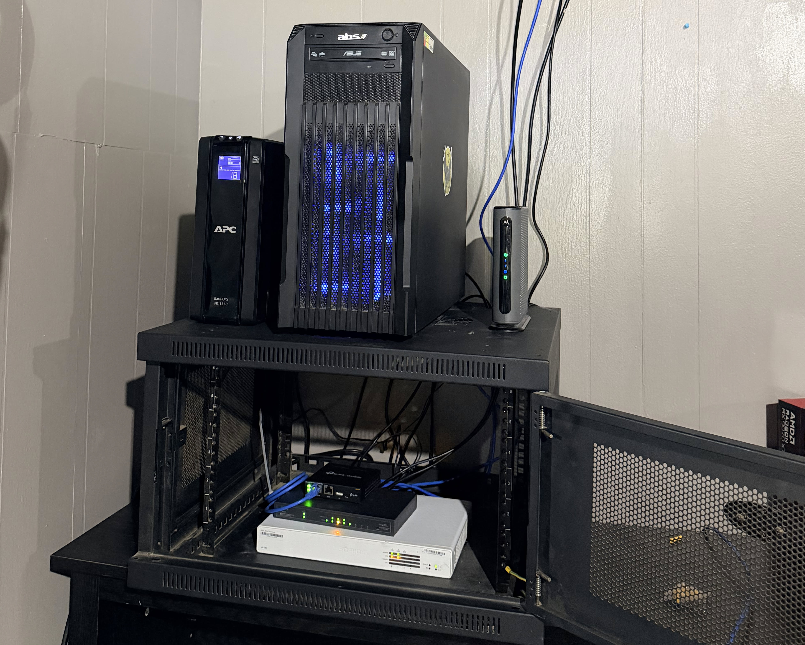
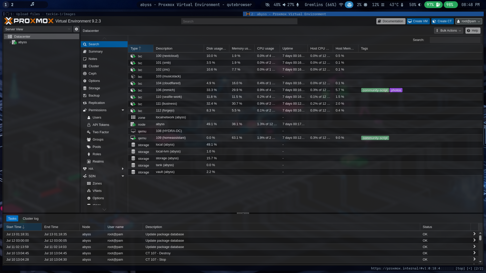

# My homelab overview

## Background

I started thinking about a homelab in 2023 when i was in school for Computer Science at my local community college. One of the main things that people were saying, seemed like everywhere that i looked, was "make a homelab for learning and testing". I'm a person that if i see or hear something that interest me, i dive down the rabbit hole, headfirst. After doing some internet searches on homelabs, I was hooked. During that research was when I really started to come across and learn about Cybersecurity. So that became my goal, to build and homelab to help me learn Cybersecurity. I started out like probably everyone else. By using virtualization software (vmware fusion) to install kali linux on my macbook pro. Fast forward a little bit and i was able to get an old 2012 hp laptop from a friend and decided to try and install a vulnerable machine on it. My idea was to use kali on my macbook to connect to my vulnerable machine (on the hp) and read writeups in order to kind of follow along. Even though i was reading along and trying it on my own hardware, I was horrible at it, everything seemed so strange and difficult. While self-learning, I came across homelabbing sub-reddits. That really planted a major seed.

## What I'm running

I am running Proxmox Virtual Environment. It has a X99 motherboard, 32GB of DDR4 Ram, GTX 980 GPU (that really isn't in use for anything) 512GB M.2 NVME OS drive and 12TB HDD for all of the heavy lifting. For home networking, I now use a Sophos XG 135 Rev.3 Firewall running opnsense. A TP-link TL-SG2009P - Jetstream 8-port gigabit smart managed POE switch with a TP-link OC200 hardware controller for centralized management. I have one TP-link EAP650 access point with more to come soon.

## Services

- Nextcloud: For family file storage.
- Seafile: Work credentials and document solution. Used to organize things that I need for working on DVR/NVR camera systems.
- Navidrome: Self hosting my large FLAC library.
- Cloudflared: Tunnel agent for external access. Exposes Nextcloud, Navidrome and, Seafile.
- ZNC: IRC bouncer
- Homebridge: Brings my ESP devices into my Apple Home ecosystem.
- SMB: Home file share.
- Immich: Image and Video storage.

## What's next

Next, I would like to build a honeypot. Details on the way..
